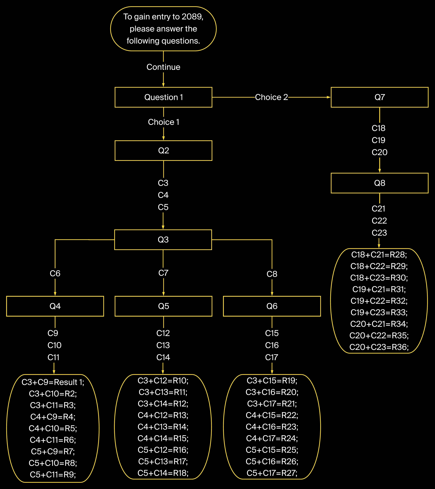

## 时间海关

2018.12.18【新增】图形化配置界面

## 全球访问路径

访问链接 [https://liuyouxing.github.io/time_customhouse/index.html](https://liuyouxing.github.io/time_customhouse/index.html "点击访问"). 

配置链接 [https://liuyouxing.github.io/time_customhouse/index.html#set](https://liuyouxing.github.io/time_customhouse/index.html#set "点击访问"). 

## 配置管理

配置说明：访问配置链接[配置链接](https://liuyouxing.github.io/time_customhouse/index.html#set "点击访问")，编辑数据，保存数据。

### 方式一，先编辑数据，然后点击“保存数据”，即可点击“访问链接”，查看效果。

### 方式二，如果想修改服务器数据，先编辑数据，然后点击“保存数据”，“复制数据”，通知作者修改。

代码修改逻辑如下图

